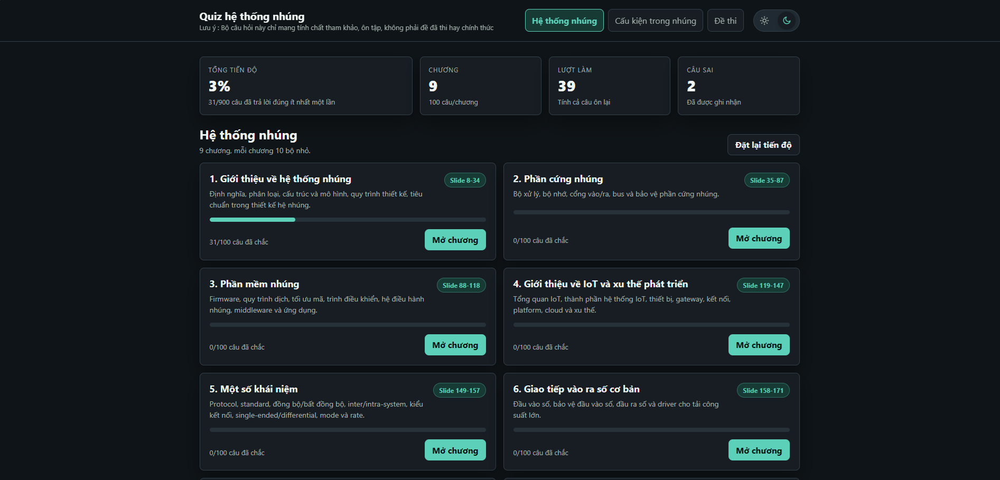

# ET4361 - Hệ thống nhúng và giao tiếp nhúng

<p align="center">
  
</p>

Ứng dụng web tĩnh phục vụ ôn tập học phần **ET4361 Hệ thống nhúng và giao tiếp nhúng** của **Đại học Bách Khoa Hà Nội**.

Project này được xây dựng như một bộ study kit nhỏ gọn: mở trực tiếp bằng trình duyệt, học theo chương, làm quiz theo bộ nhỏ, ôn câu sai theo cơ chế lặp lại, và luyện đề mô phỏng có đáp án giải thích.

## Lưu Ý Quan Trọng

Bộ câu hỏi và đề thi trong repo này **chỉ mang tính chất tham khảo, ôn tập, không phải đề đã thi hay đề chính thức**.

Nội dung trong repo không có mục đích dự đoán chính xác đề thi, không thay thế giáo trình, bài giảng, hướng dẫn của học phần, hay yêu cầu từ giảng viên. Khi học, nên đối chiếu lại với tài liệu chính thức của môn học và tự kiểm chứng các nội dung quan trọng.

## Tính Năng Chính

- **Hệ thống nhúng**: học theo các mục của đề cương ôn tập chính thức, từ tổng quan đến phần cứng, phần mềm, I/O, bảo vệ, giao tiếp nâng cao, ADC và EMC.
- **Cấu kiện trong nhúng**: ôn lại các linh kiện, mạch giao tiếp, mạch nguồn, mạch bảo vệ và các kiến thức điện tử ứng dụng gần với hệ thống nhúng.
- **Đề thi**: các bộ đề mô phỏng để luyện tập, gồm trắc nghiệm và câu tự luận tham khảo.
- **Quiz theo bộ nhỏ**: mỗi chương được chia thành nhiều bộ câu hỏi để không phải làm quá dài trong một lần.
- **Lặp lại câu sai**: câu trả lời sai có thể xuất hiện lại sau đó để củng cố trí nhớ.
- **Giải thích đáp án**: mỗi lựa chọn có giải thích vì sao đúng hoặc không phù hợp.
- **Tiến độ cá nhân**: tiến độ được lưu trên trình duyệt của từng người bằng `localStorage`.
- **Light/Dark theme**: có công tắc chuyển giao diện sáng/tối ở thanh trên cùng.
- **Không cần backend**: chỉ cần các file HTML, CSS và JavaScript tĩnh.

## Cách Sử Dụng

### Cách Nhanh Nhất

Mở file `index.html` bằng trình duyệt.

```text
index.html
```

### Chạy Bằng Local Server

Nếu muốn dùng địa chỉ localhost thay vì mở file trực tiếp:

```bash
python -m http.server 8000
```

Sau đó mở:

```text
http://localhost:8000
```

## Cách Học Gợi Ý

1. Bắt đầu từ tab **Hệ thống nhúng**.
2. Chọn từng chương và học theo các bộ câu hỏi nhỏ.
3. Đọc giải thích sau mỗi câu, đặc biệt là các lựa chọn sai.
4. Dùng mục ôn câu sai để lặp lại những kiến thức chưa chắc.
5. Sau khi đã học qua lý thuyết chính, chuyển sang **Cấu kiện trong nhúng** để củng cố phần điện tử ứng dụng.
6. Cuối cùng làm tab **Đề thi** để luyện tốc độ, cách đọc câu hỏi và cách lập luận cho câu tự luận.

## Tiến Độ Và Cache

Tiến độ học tập không nằm trong repo. Ứng dụng lưu tiến độ trong trình duyệt bằng các key:

```text
embedded-quiz-progress-v1
embedded-quiz-active-section
```

Vì vậy:

- Người clone repo mới sẽ bắt đầu với tiến độ trống.
- Việc commit hoặc push source code không làm mất tiến độ đang có trên trình duyệt của máy hiện tại.
- Nếu đổi trình duyệt, đổi máy, xóa dữ liệu website hoặc chạy ở origin khác, tiến độ có thể không còn.
- Có thể dùng nút đặt lại tiến độ trong giao diện nếu muốn học lại từ đầu.

## Nguồn Tham Khảo

Nội dung ôn tập được hệ thống hóa từ bài giảng học phần ET4361 Hệ thống nhúng và giao tiếp nhúng của TS Đào Việt Hùng, kết hợp với các kiến thức điện tử ứng dụng trong hệ thống nhúng và các tài liệu kỹ thuật công khai.

Các tài liệu nguồn trong thư mục `docs/` chỉ được giữ cục bộ để phục vụ quá trình tổng hợp kiến thức, không được đưa lên repo.

## Cấu Trúc Repo

```text
.
├── index.html
├── styles.css
├── app.js
├── embedded-data.js
├── components-data.js
├── exam-data.js
├── assets/
│   └── official/
├── .gitignore
└── README.md
```

Trong đó:

- `index.html`: file vào ứng dụng.
- `styles.css`: giao diện và responsive layout.
- `app.js`: logic render, điều hướng, chấm quiz, lưu tiến độ.
- `embedded-data.js`: ngân hàng câu hỏi phần Hệ thống nhúng, được chia theo các mục 1.1 đến 2.5 của đề cương ôn tập.
- `components-data.js`: nội dung phần Cấu kiện trong nhúng, gồm bài giảng và quiz.
- `exam-data.js`: các bộ đề mô phỏng và gợi ý câu tự luận.
- `assets/official/`: ảnh minh họa dùng trong bài giảng.
- `README.md`: mô tả repo, cách dùng, phạm vi nội dung và lưu ý.

## Mức Độ Phân Loại Câu Hỏi

Bảng dưới đây tóm tắt phạm vi kiến thức và mức độ câu hỏi dùng để xây dựng ngân hàng ôn tập. Mức Bloom được hiểu theo hướng:

- **1 - Nhớ**: định nghĩa, liệt kê, nhận diện.
- **2 - Hiểu**: giải thích, phân loại, so sánh cơ bản.
- **3 - Vận dụng**: tính toán hoặc áp dụng quy trình vào tình huống.
- **4 - Phân tích**: phân tách thành phần, tìm nguyên nhân, so sánh sâu.
- **5 - Đánh giá**: chọn phương án hợp lý, đánh giá theo tiêu chí.
- **6 - Sáng tạo/thiết kế**: đề xuất hoặc thiết kế phương án mới theo yêu cầu cho trước.

| Phần/Mục | Nội dung | Yêu cầu ôn tập | Mức Bloom |
|---|---|---|---|
| **1. Hệ thống nhúng** |  |  |  |
| **1.1 Tổng quan** | Định nghĩa, đặc điểm, phân loại | Ghi nhớ và hiểu các lý thuyết nền tảng. | 1-2 |
|  | Cấu trúc và mô hình hệ thống nhúng | Ghi nhớ và hiểu các mô hình, lớp và thành phần điển hình. | 1-2 |
|  | Quy trình thiết kế hệ thống nhúng | Ghi nhớ và hiểu các bước thiết kế, tích hợp và kiểm thử. | 1-2 |
| **1.2 Phần cứng nhúng** | Bộ xử lý | Không yêu cầu nhớ model chip cụ thể; cần biết đặc trưng cơ bản của các họ chip quan trọng như AVR, STM32, ESP32; hiểu khác biệt giữa CPU, MCU, FPGA, DSP, ASIC. | 1, 2, 4, 5 |
|  | Bộ nhớ | Hiểu nguyên lý lưu trữ, ưu/nhược điểm, khác biệt giữa bộ nhớ chương trình và dữ liệu; RAM, ROM, Flash. | 1, 2, 4, 5 |
|  | Cổng vào/ra và bus truyền thông | Ghi nhớ và hiểu các khái niệm, vai trò I/O và bus trong hệ nhúng. | 1-2 |
|  | Ngoại vi nhúng | Ghi nhớ và hiểu ngoại vi nhúng; không yêu cầu nhớ ví dụ chip cụ thể có ngoại vi cụ thể nào. | 1-2 |
|  | Vấn đề năng lượng | Học kỹ các yếu tố ảnh hưởng năng lượng; không yêu cầu nhớ số liệu tiêu thụ cụ thể của từng chip trong bảng/đồ thị minh họa. | 1-5 |
| **1.3 Phần mềm nhúng** | Một số khái niệm | Nhớ và hiểu khái niệm; phân tích, đánh giá khác biệt, ưu/nhược điểm của các phân loại liên quan. | 1, 2, 4, 5 |
|  | Quy trình dịch sang mã máy | Học kỹ quy trình từ mã nguồn tới mã máy, liên kết, nạp và các lỗi liên quan. | 1-5 |
|  | Trình điều khiển | Ghi nhớ và hiểu vai trò, phân loại, cách tổ chức truy cập phần cứng. | 1-2 |
|  | Hệ điều hành nhúng | Ghi nhớ và hiểu các khái niệm hệ điều hành nhúng, nhân, tác vụ, luồng, quản lý ngữ cảnh. | 1-2 |
|  | Phần mềm trung gian và phần mềm ứng dụng | Ghi nhớ và hiểu vai trò của lớp trung gian, lớp ứng dụng và quan hệ với phần cứng/phần mềm hệ thống. | 1-2 |
|  | Bộ nạp khởi động và khởi động hệ thống | Học kỹ vai trò mã khởi động, vector khởi động, bộ nạp khởi động và cập nhật an toàn. | 1-5 |
| **2. Thiết kế giao tiếp nhúng** |  |  |  |
| **2.1 Một số khái niệm** | Tất cả | Nhớ và hiểu các khái niệm giao tiếp, giao thức, chuẩn, kiểu truyền và tốc độ truyền. | 1-2 |
| **2.2 Giao tiếp I/O cơ bản** | Cấu trúc mạch I/O | Nhớ và hiểu cấu trúc điển hình; phân tích được các khối; không yêu cầu nhớ cấu trúc I/O cụ thể của một họ chip. | 1, 2, 4 |
|  | Chức năng I/O số | Ghi nhớ và hiểu lý thuyết; lưu ý cách chọn giao tiếp ngoại vi theo ràng buộc thiết kế. | 1-2 |
|  | Chức năng I/O tương tự | Ghi nhớ và hiểu lý thuyết; lưu ý ADC, DAC, PWM và lựa chọn ngoại vi theo ràng buộc thiết kế. | 1-2 |
|  | Giao tiếp ngoại vi cơ bản | Ghi nhớ và hiểu lý thuyết; lưu ý chọn giao tiếp theo số chân, tốc độ, khoảng cách, nhiễu và số thiết bị. | 1-2 |
| **2.3 Bảo vệ cổng I/O** | Mục đích của việc bảo vệ | Ghi nhớ và hiểu mục tiêu bảo vệ I/O trước quá áp, quá dòng, xung nhiễu và môi trường ngoài. | 1-2 |
|  | ESD và sự nguy hại | Ghi nhớ và hiểu bản chất phóng tĩnh điện, rủi ro và đường xả xung. | 1-2 |
|  | Cơ chế và các giải pháp bảo vệ | Học kỹ; có thể có thiết kế mạch bảo vệ quá áp mức đơn giản theo yêu cầu cho trước. | 1-6 |
| **2.4 Giao tiếp nhúng nâng cao** | Tất cả | Ghi nhớ và hiểu UART, RS-232, RS-485, SPI, I2C; nhớ công thức và con số liên quan ADC ở mức cần dùng; có thể có tính toán theo công thức. | 1-3 |
| **2.5 Signal Integrity và EMC** | Tất cả | Học kỹ các nguồn nhiễu, đường truyền nhiễu, nối mass, che chắn, bố trí mạch in, dây/cáp và biện pháp giảm nhiễu. | 1-5 |

## Phạm Vi Nội Dung

Phần **Hệ thống nhúng** và **Đề thi** hiện bám các mục chính của đề cương ôn tập:

- tổng quan hệ thống nhúng: định nghĩa, đặc điểm, phân loại, cấu trúc, mô hình và quy trình thiết kế;
- phần cứng nhúng: bộ xử lý, bộ nhớ, I/O, bus, ngoại vi và vấn đề năng lượng;
- phần mềm nhúng: firmware, quy trình dịch, tối ưu mã, driver, hệ điều hành nhúng, middleware, ứng dụng, bootloader và khởi động hệ thống;
- khái niệm giao tiếp: protocol, standard, đồng bộ/bất đồng bộ, inter/intra-system, kiểu kết nối, single-ended/differential, simplex/half-duplex/full-duplex và tốc độ truyền;
- giao tiếp I/O cơ bản: đầu vào số, đầu ra số, analog I/O, DAC, PWM và chọn ngoại vi theo ràng buộc thiết kế;
- bảo vệ cổng I/O: ESD, quá áp, hạn dòng, diode clamp, TVS, Zener, optocoupler, digital isolator và thiết kế bảo vệ đơn giản;
- giao tiếp nâng cao: UART, RS-232, RS-485, SPI, I2C, ADC, sai số ADC, lấy mẫu, Vref, lọc, oversampling, DAC và PWM;
- Signal Integrity và EMC: nguồn nhiễu, đường truyền nhiễu, shielding, grounding, cáp xoắn, layout analog/digital/công suất và giảm nhiễu.

Phần **Cấu kiện trong nhúng** là nội dung bổ trợ để ôn lại các kiến thức điện tử ứng dụng gần với môn học:

- transistor, MOSFET, relay, diode, op-amp, comparator;
- bảo vệ cổng vào ra, ESD, clamp, diode flyback;
- nguồn, lọc nguồn, decoupling, reset, watchdog và chống nhiễu;

Tab **Đề thi** cung cấp các đề tham khảo để luyện trắc nghiệm và tự luận.

## Cách Cập Nhật Nội Dung

Khi muốn bổ sung câu hỏi:

1. Sửa file data tương ứng: `embedded-data.js`, `components-data.js` hoặc `exam-data.js`.
2. Giữ câu hỏi rõ ràng, hỏi trực tiếp vào kiến thức, không hỏi kiểu "trong slide này" nếu giao diện không hiện slide hoặc hình đó.
3. Mỗi câu nên có đáp án đúng và giải thích cho từng lựa chọn.
4. Nếu nội dung có ký hiệu như `<`, `<=`, `<->`, có thể để nguyên trong text; ứng dụng đã escape khi render.
5. Mở lại ứng dụng và kiểm tra luồng làm bài trước khi commit.

## Kiểm Tra Nhanh

Có thể kiểm tra lỗi cú pháp JavaScript bằng:

```bash
node --check app.js
node --check embedded-data.js
node --check components-data.js
node --check exam-data.js
```

## Ghi Chú Về Repo Sạch

Thư mục `tmp/`, `docs/`, cache render/OCR, log và các file nguồn lớn không được đưa vào Git. Repo chỉ nên chứa những file cần thiết để chạy ứng dụng và nội dung đã được đóng gói trong các file data của app.
